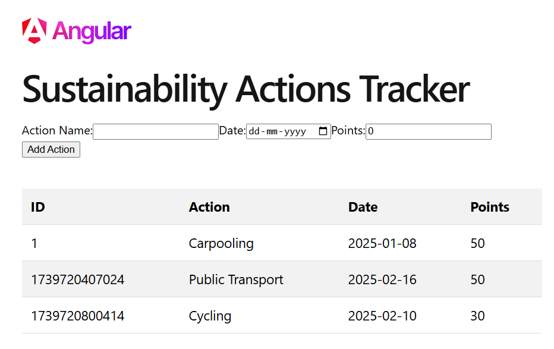
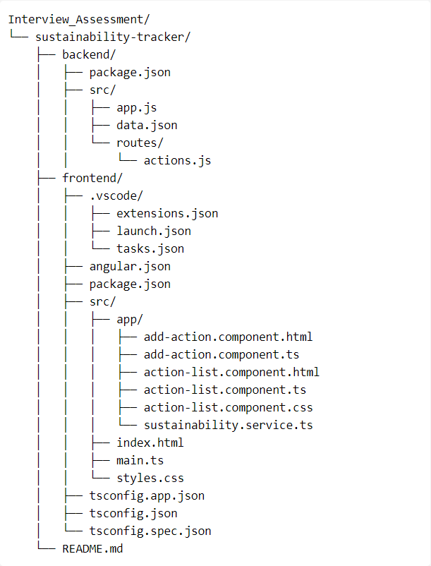

# Sustainability Tracker

This project is a basic system to track and display sustainability actions (e.g., carpooling, recycling, reducing plastic use). It includes a Node.js backend API and an Angular frontend. The backend uses JSON to store sustainability actions and exposes RESTful endpoints for interaction. The frontend interacts with the backend via GET and POST requests.

# Home Page



# Project Structure



# Backend

## Tech Stack

- Node.js
- Express.js

## Setup

1. Navigate to the backend directory:
   ```sh
   cd Interview_Assessment/sustainability-tracker/backend

2. Install Dependencies:
    ```sh
    npm install

3. Start the Server:
    ```sh
    npm start

## Features

- **GET Endpoint**: Fetch a list of sustainability actions stored in a JSON file.
  - URL: `/api/actions`
- **POST Endpoint**: Add a new sustainability action to the JSON file.
  - URL: `/api/actions`
  - Payload format:
    ```json
    {
      "id": 1,
      "action": "Carpooling",
      "date": "2025-01-08",
      "points": 50
    }
    ```

# Frontend

## Tech Stack

- Angular

## Setup

1. Navigate to the frontend directory:
    ```sh
    cd Interview_Assessment/sustainability-tracker/frontend

2. Install dependencies
    ```sh 
    npm install

3. Start the development server
    ```sh 
    ng serve

4. Open browser and navigate to ```http://localhost:4200```

## Features

- **Display Actions**: Fetch and display sustainability actions using the GET endpoint. Display in a simple table format with columns: ID, Action, Date, Points.

- **Add Action Form**: Form fields: Action Name, Date, Points. Submit the form data to the POST endpoint. Clear form on success.


